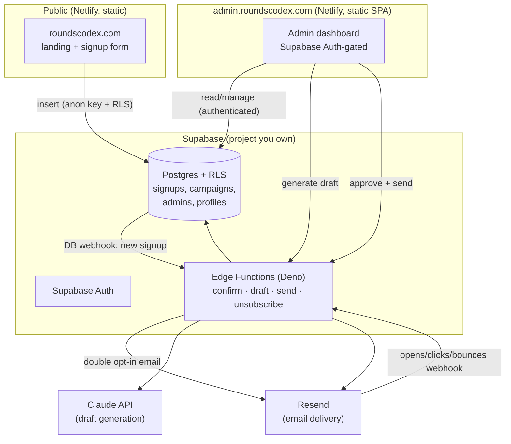

# Rounds Codex — backend platform plan

**Status:** proposal for sign-off. No backend code is written yet (by request). This document is
the design; once approved, Phase 1 begins.

**Date:** 2026-07-30
**Decisions locked:** Supabase (project exists) · Resend for email · AI drafts are
**draft-for-approval, never auto-send** · plan-first.

---

## 1. What we're building

A backend for roundscodex.com that starts as a launch-list capture and grows into the product's
account + comms platform:

1. **Email capture** on the landing page → stored in Supabase.
2. **Admin dashboard** — a private, authenticated app to see signups/users, compose and send
   launch emails + newsletters, and (later) view app-connected user data.
3. **Email + newsletter automation** — Claude **drafts** an email/newsletter; it is only sent
   after you review and approve it in the dashboard; Resend delivers it.
4. **(Later) App-connected user data** — accounts and study progress synced from the app, which
   is currently device-local only.

Guiding constraints:
- **You are the gate.** Nothing reaches a real inbox without your click. AI writes drafts, not
  sends.
- **Secrets never touch the public repo.** Only the Supabase *anon* key (designed to be public)
  and the site's own URLs live in client code; every privileged key lives in server-side env.
- **No patient data, ever.** This is educational software. The plan below assumes personal
  account data (email, name, study progress) — not PHI. See §8.

---

## 2. Architecture at a glance



**Why this shape:** it keeps the whole stack inside tools you already have (Supabase + Netlify)
plus Resend + Claude. All secret-holding logic lives in **Supabase Edge Functions**, so the
static sites never hold a privileged key.

---

## 3. Data model (Postgres, in Supabase)

Proposed tables. SQL shown for review; it becomes a migration in Phase 1.

```sql
-- 3.1 Launch-list signups (written by the public site)
create table public.signups (
  id            uuid primary key default gen_random_uuid(),
  email         text not null,
  role          text,                       -- 'nursing' | 'medical' | 'resident' | 'other' | null
  source        text not null default 'landing',
  status        text not null default 'pending',  -- pending | confirmed | unsubscribed | bounced
  confirm_token uuid default gen_random_uuid(),
  created_at    timestamptz not null default now(),
  confirmed_at  timestamptz,
  unsubscribed_at timestamptz,
  user_agent    text
);
create unique index signups_email_uidx on public.signups (lower(email));
alter table public.signups enable row level security;

-- Anonymous visitors may ONLY insert a pending signup — nothing else.
create policy signups_anon_insert on public.signups
  for insert to anon
  with check (status = 'pending');
-- (No anon select/update/delete. Admin reads via the authenticated policy in 3.3.)

-- 3.2 Email campaigns / newsletters
create table public.campaigns (
  id          uuid primary key default gen_random_uuid(),
  subject     text not null,
  preheader   text,
  body_html   text,
  body_text   text,
  status      text not null default 'draft',   -- draft | approved | sending | sent | canceled
  audience    text not null default 'confirmed', -- which signups to target
  ai_model    text,                             -- model used for the draft, if any
  ai_prompt   text,                             -- prompt/brief the draft came from
  created_by  uuid references auth.users(id),
  created_at  timestamptz not null default now(),
  approved_by uuid references auth.users(id),
  approved_at timestamptz,
  sent_at     timestamptz
);
create table public.campaign_sends (
  id          uuid primary key default gen_random_uuid(),
  campaign_id uuid not null references public.campaigns(id) on delete cascade,
  signup_id   uuid not null references public.signups(id) on delete cascade,
  status      text not null default 'queued',  -- queued | sent | delivered | opened | clicked | bounced | failed
  resend_id   text,
  error       text,
  updated_at  timestamptz not null default now()
);

-- 3.3 Admin allowlist (who may use the dashboard)
create table public.admins (
  user_id  uuid primary key references auth.users(id) on delete cascade,
  email    text not null,
  added_at timestamptz not null default now()
);
-- Helper used by RLS policies:
create or replace function public.is_admin() returns boolean
  language sql security definer stable as
  $$ select exists (select 1 from public.admins where user_id = auth.uid()) $$;

-- Admins can read/manage signups + campaigns:
create policy signups_admin_all on public.signups
  for all to authenticated using (public.is_admin()) with check (public.is_admin());
alter table public.campaigns enable row level security;
create policy campaigns_admin_all on public.campaigns
  for all to authenticated using (public.is_admin()) with check (public.is_admin());
alter table public.campaign_sends enable row level security;
create policy sends_admin_all on public.campaign_sends
  for all to authenticated using (public.is_admin()) with check (public.is_admin());
```

**Later — app accounts (Phase 4, sketch only):** `profiles` (1:1 with `auth.users`), and study
data tables mirroring what the app keeps in `localStorage` today (`bookmarks`, `quiz_attempts`,
`nclex_attempts`, `review_schedule`). Each row owned by its user via RLS
(`user_id = auth.uid()`). This is a substantial app change and is intentionally deferred; see §7.

---

## 4. Auth & secrets

**Auth:** Supabase Auth. Admin access = a row in `public.admins`. You seed the first admin (your
email) once. Sign-in via magic link or email+password (recommend **magic link** — no password to
leak). Every privileged table is behind `is_admin()` RLS, so even a leaked anon key can only
insert a pending signup.

**Secret placement (hard rules):**

| Secret | Lives in | In the public repo? |
|---|---|---|
| Supabase project URL | client (landing + admin) | ✅ yes — it's public |
| Supabase **anon** key | client (landing + admin) | ✅ yes — public by design, safe behind RLS |
| Supabase **service_role** key | Supabase Edge Function secrets only | ❌ **never** |
| `RESEND_API_KEY` | Edge Function secrets | ❌ never |
| `ANTHROPIC_API_KEY` | Edge Function secrets | ❌ never |

The service_role key bypasses RLS — it stays server-side (Edge Functions), never in the SPA,
never in git.

---

## 5. Email: Resend + deliverability

- **Sending domain:** `roundscodex.com`. Resend gives DNS records to add at GoDaddy (or Netlify
  DNS): **SPF**, **DKIM**, and a **DMARC** record. Without these, launch mail lands in spam.
- **From/reply:** e.g. `Rounds Codex <hello@roundscodex.com>`.
- **Double opt-in:** signup inserts `status='pending'` → DB webhook fires an Edge Function →
  Resend sends a "confirm your email" link → clicking it sets `status='confirmed'`. This protects
  domain reputation and is best practice.
- **Compliance (CAN-SPAM / GDPR):** every campaign needs a working **unsubscribe** link
  (one-click → sets `unsubscribed_at`, excluded from all future sends) and a **physical mailing
  address** in the footer. The dashboard will enforce both before it lets you send.
- **Webhooks:** Resend posts delivery/open/click/bounce events to an Edge Function that updates
  `campaign_sends`, so the dashboard shows real stats and auto-marks hard bounces.

---

## 6. Admin dashboard

**Stack:** a small **Vite + React SPA** using `@supabase/supabase-js` for data + auth, hosted as
a second Netlify site at **admin.roundscodex.com**. All privileged actions (send, AI draft,
export) go through Supabase Edge Functions, so the SPA holds no secrets. (Alternative considered:
Next.js on Vercel — rejected to keep everything on Netlify + Supabase, matching your stack.)

**Phase-2 features:** magic-link login (admins only) · signup list with search/filter/CSV export
· dashboard tiles (total / confirmed / unsubscribed, signups over time, by role) · manual
add/remove.

**Phase-3 features:** campaign composer · **"Draft with AI"** (Claude writes subject +
preheader + body from a short brief; you edit freely) · live preview + send-test-to-myself ·
explicit **Approve** then **Send** (two steps, never one) · per-recipient send log and
open/click stats · unsubscribe management.

**Phase-4 features (later):** view app-connected user profiles + study progress (read-mostly),
respecting the same privacy rules.

---

## 7. AI generation (Claude) — draft only

- An Edge Function calls the Claude API with your brief (e.g. "announce launch, warm, 150 words,
  one CTA") and returns subject + preheader + HTML/text body into a **draft** campaign.
- **It never sends.** Status goes `draft → (you edit) → approved → sending → sent`. The send step
  is a separate, deliberate click.
- Model: a current Claude model via the Anthropic API; cost is per-use and tiny at newsletter
  volumes. Key stored server-side (§4).
- Medical-safety guardrail: drafts are marketing/announcement copy. Any clinical claim still goes
  through you, exactly like quiz content does today.

---

## 8. Privacy, legal, and the medical angle

- **No PHI.** The product is educational. We store account + study data (email, role, quiz
  attempts) — a user's own learning activity, not patient data. The app must never invite users
  to enter patient information; a line in the ToS will say so.
- **Needed before launch email goes out:** a **Privacy Policy** and **Terms** page (I can draft
  both), a cookie/analytics note if analytics are added, and the unsubscribe + postal address in
  every campaign (§5).
- **Data handling:** signups are personal data. Support delete-on-request (GDPR/CCPA). RLS keeps
  every row invisible to the public.
- **App study data (Phase 4)** stays device-local until the user opts into an account; syncing is
  opt-in, and this ties into `native-app-plan.md`.

---

## 9. Phases, deliverables, and what each needs from you

| Phase | Deliverable | Needs from you |
|---|---|---|
| **0 — now** | This plan + final schema SQL | Sign-off |
| **1 — capture** | `signups` table live; landing form wired (anon insert + RLS); double opt-in + welcome email; unsubscribe endpoint | Supabase URL + anon key; Resend account + verify `roundscodex.com` DNS; a from-address |
| **2 — admin shell** | admin.roundscodex.com: magic-link login, admin allowlist, signup list + CSV export + stats | Your admin email to seed; a Netlify site for the subdomain |
| **3 — campaigns** | Composer, Claude "draft with AI", approve→send via Resend, per-recipient logging, open/click stats | Anthropic API key (server-side); confirm from-name + postal address for footer |
| **4 — app accounts** | Opt-in accounts + study-progress sync from the app (big app change) | Separate go-ahead; coordinates with the native-app plan |

**Rough cost:** Supabase free tier is fine to start (Pro $25/mo when you outgrow it); Resend free
covers 3,000 emails/mo (100/day); Claude drafting is cents per newsletter. ≈ $0 until volume.

---

## 10. Open decisions before Phase 1

1. **Config delivery:** paste the Supabase **URL + anon key** here (safe — both public), or add
   them as Netlify env vars and I read them at build? (Either works; env is tidier.)
2. **Signup form fields:** email only, or email + a "I am a…" role picker (nursing/med/resident)?
   The role makes future newsletters targetable — I recommend including it.
3. **Opt-in:** double opt-in (recommended, better deliverability) or single opt-in (one fewer
   click, slightly worse inbox placement)?
4. **Admin subdomain:** `admin.roundscodex.com` (recommended) or a hard-to-guess path on the main
   site?
5. **Legal pages:** want me to draft Privacy Policy + Terms as part of Phase 1?

Once you answer these (or say "your recommendations"), I'll turn Phase 1 into working code:
schema migration, the wired signup form, and the opt-in + welcome email function.
